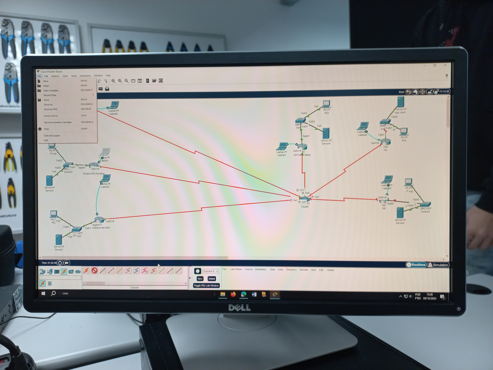

# Laboratório de Redes com EIGRP e SSH

## 📌 Sobre o projeto

Este projeto simula uma infraestrutura de rede utilizando roteamento dinâmico (EIGRP) e acesso remoto seguro via SSH.

O objetivo foi aplicar, na prática, conceitos fundamentais de redes, incluindo segmentação, comunicação entre sub-redes e controle de acesso.

---

## 🧠 Conceitos aplicados

- Roteamento dinâmico com EIGRP  
- Subnetting (/28)  
- Configuração de interfaces LAN/WAN  
- Acesso remoto seguro (SSH)  
- Criptografia de senhas  
- Frame Relay (ambiente simulado)  

---

## ⚙️ Implementação

- Configuração completa de roteador Cisco  
- Criação de usuários com diferentes níveis de privilégio  
- Configuração de acesso remoto via SSH  
- Ativação e validação de interfaces  
- Propagação de rotas com EIGRP  

---

## 📊 Resultados

- Comunicação entre redes estabelecida com sucesso  
- Acesso remoto funcional via SSH  
- Estrutura de rede segmentada e organizada  

---

## 📸 Topologia

---

## 🔗 Documentação completa

Notion: [Clique Aqui](https://tartan-chicken-a7b.notion.site/Projeto-202-Europa-G2-Di-rio-de-Bordo-fb0f54394c02409c8de5187e5793020a)
